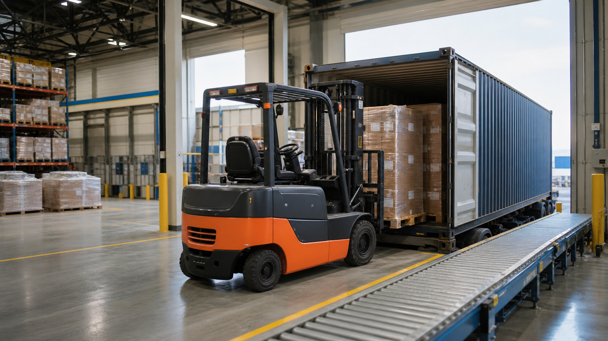
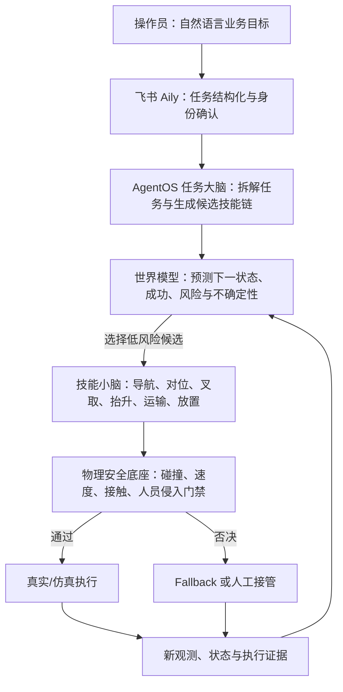
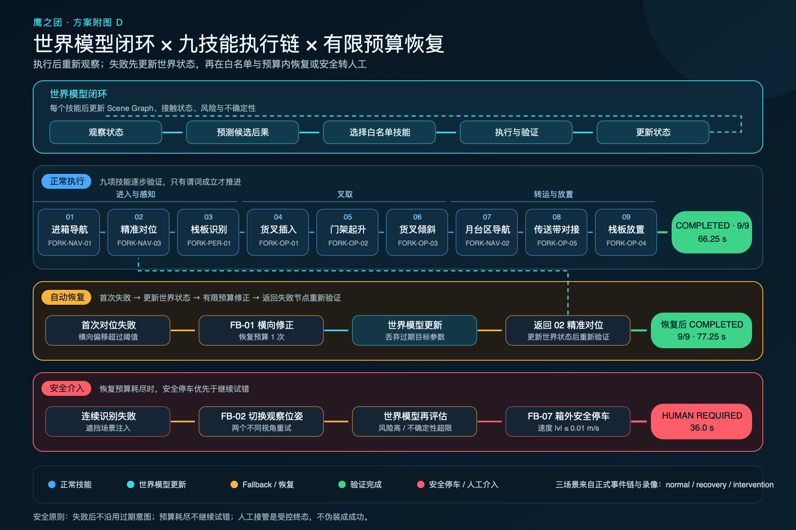
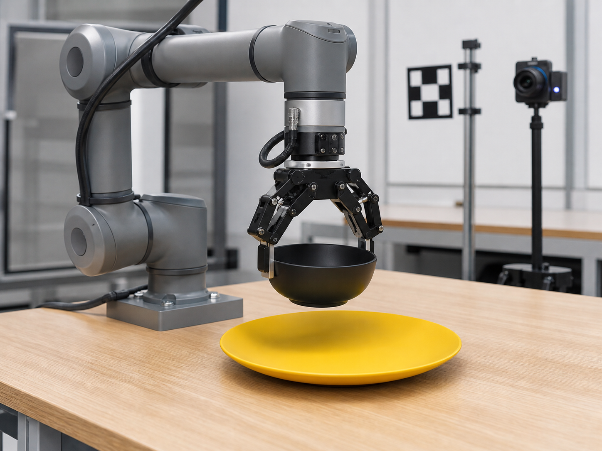
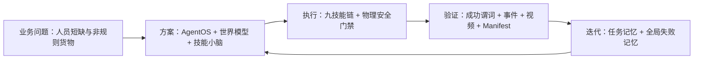
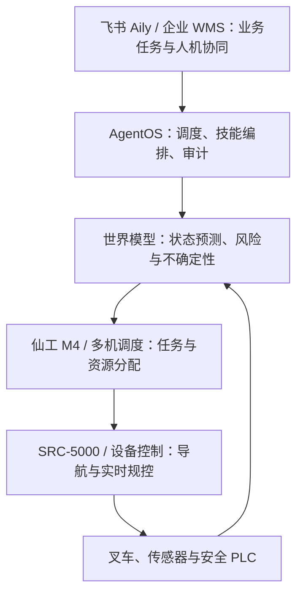

# 【40强赛】仙工智能🤝鹰之团｜世界模型驱动的分层智能叉车卸货系统



> **一句话方案**：我们为仙工智能构建“飞书 Aily 业务入口 + AgentOS 任务大脑 + 世界模型预测层 + 技能小脑 + 物理安全底座”，把叉车师傅面对非规则货物时的观察、预判、调整和恢复经验，转化为可执行、可审计、可持续学习的智能卸货闭环。

> **项目原则**：不是为了使用 AI 而使用 AI。规则可以稳定解决的问题继续交给规控；只有货物偏移、尺寸变化、遮挡、接触不确定性和异常恢复等传统脚本难覆盖的关键环节，才由世界模型和 AgentOS 参与判断。

---

## 一、参赛方案信息卡【必须包含】

| 项目 | 内容 |
| --- | --- |
| 参赛队伍 | 鹰之团 |
| 选择的企业赛题 | 仙工智能：工业场景分拣配送机器人方案 |
| 聚焦场景 | 前仓月台智能叉车完成集装箱卸货、搬运、异常恢复与安全交接 |
| 方案定位 | 面向企业联合验证的仿真 Demo；验证世界模型预测、任务编排、技能执行、Fallback、人机协同和审计闭环 |
| 一句话价值 | 缓解熟练叉车师傅供给下降与多月台等待瓶颈，把个人经验沉淀为企业可复用的智能能力 |
| 在线体验 | [https://demo.aplearn.xyz/](https://demo.aplearn.xyz/) |
| 公开代码与证据 | [https://github.com/imChenRH/seer-competition](https://github.com/imChenRH/seer-competition) |

### 团队成员与分工

| 成员 | 背景 | 主要分工 |
| --- | --- | --- |
| 陈睿泓（队长） | 中山大学计算机系，大二 | 整体算法架构、AgentOS 与世界模型方案、资源获取、环境配置、证据规范与项目统筹 |
| 程千弘（队员） | 香港大学量化金融系，大二 | 仿真平台建模、仓储场景与机器人行为实现、运行数据分析和展示优化 |

### 飞书 AI 能力应用

本方案把飞书设计为企业的 AI 操作入口和协同中枢，而不是单纯的展示页面：

- **飞书 Aily**：接收操作员自然语言任务，识别目标、约束、优先级和风险，生成结构化任务意图。
- **飞书多维表格**：统一维护技能库、Fallback 策略库、任务运行表、审计日志表和叉车状态表五张核心数据表。
- **飞书消息**：人工侵入、自动恢复失败或风险升级时，推送包含运行 ID、现场状态和建议动作的接管请求。
- **飞书开放平台 API**：把企业主数据、AgentOS、仿真服务和设备状态接入同一受控数据链路。
- **飞书会议与知识沉淀**：把叉车师傅访谈、异常复盘和试点参数转化为世界模型的场景先验、成功规则和失败记忆。

---

## 二、参赛成果介绍【必须包含】

## 1. 行业痛点：为什么这个场景必须使用智能

### 1.1 熟练叉车师傅正在成为稀缺资源

根据本项目与企业人员的场景访谈，月台卸货目前仍高度依赖年长、经验丰富的叉车师傅。这个岗位需要长期积累对货叉位置、车辆姿态、货物重心、托盘间隙和接触反馈的判断，但工作本身重复、枯燥，月台环境又常呈现“夏热冬冷”、噪声大、车流与人流交织等特点，年轻劳动者进入和长期留任的意愿较低。

这产生了一个结构性矛盾：

- 岗位人数逐年承压，但企业不能简单用普通搬运工替代熟练叉车师傅。
- 叉车师傅数量少，一个仓库可能有十几个装卸月台，却只有少量熟练人员轮转。
- 当多个车厢同时到货时，理货、码垛和普通搬运人员会等待叉车师傅，形成月台排队与产线节拍损失。
- 师傅的关键经验主要存在于个人判断中，难以标准化复制，也难在人员流动后保留。

> “十几个月台、少量叉车师傅”来自企业访谈中的典型现场描述，用于说明瓶颈机制，不作为全行业统计数据。

### 1.2 真实货物并不规则，传统自动化只能覆盖理想工况

如果每个托盘尺寸、间距、朝向和摆放位置都完全一致，传统定位和规则脚本已经足够。但真实集装箱内存在大量变化：

- 货物相对标准位置发生横向或纵向偏移；
- 相邻货物在运输摩擦中互相挤压，栈板孔位不再完全可见；
- 货物、托盘和栈板存在不同规格与高度；
- 包装、缠绕膜或相邻箱体形成局部遮挡；
- 有的车厢整托运输，有的货物没有预先上栈板，需要理货工先完成码垛；
- 货叉进入角度、插入深度、门架高度和车辆姿态必须随现场调整。

熟练师傅不是重复一条固定轨迹，而是在持续完成“观察目标—判断偏差—预估接触—调整方向—验证结果—再次修正”。这正是需要智能的地方：系统必须根据当前世界状态预测候选动作的后果，而不是机械重放参考坐标。

### 1.3 核心业务痛点与 AI 切入点

| 业务痛点 | 传统方式的局限 | 本方案的 AI 作用 |
| --- | --- | --- |
| 熟练人员稀缺 | 招聘和培养周期长，经验难复制 | 从运行轨迹与复盘中提炼成功规则和失败模式，形成企业记忆 |
| 多月台等待叉车 | 依赖师傅人工排队和临场调度 | AgentOS 根据优先级、设备状态和任务图进行统一编排 |
| 货物偏移、尺寸变化、遮挡 | 固定坐标和阈值规则容易失效 | 世界模型维护场景状态，预测重新对位、叉取和撤离结果 |
| 抓取或识别失败 | 停机后依赖工程师或师傅排查 | Fallback 在有限预算内重定位、换观察位或安全转人工 |
| 实机试错风险高 | 可能碰撞、停线或损伤货物 | 在显式物理世界模型中先演算路径、接触和安全边界 |
| 决策过程难追踪 | 人工经验和模型输出均难审计 | 每个状态、预测、技能、Fallback 和终态写入同一证据链 |

### 1.4 改造前后对比

| 对比维度 | 改造前：人工经验 / 固定自动化 | 改造后：世界模型分层智能系统 |
| --- | --- | --- |
| 人员组织 | 少量叉车师傅逐月台、逐托操作 | 师傅处理例外、审核策略并监督多台设备 |
| 任务入口 | 口头沟通、人工排队或固定按钮 | Aily 结构化自然语言任务，AgentOS 统一编排 |
| 场景适应 | 依赖师傅临场调整，脚本只适应规则摆放 | 世界模型根据当前状态预测偏移、遮挡和接触后果 |
| 执行方式 | 人工连续控制，或单条固定轨迹 | 白名单技能小脑执行，状态满足后才推进 |
| 异常处理 | 停机等待师傅或工程师排查 | 在预算内重新观察、重新对位、换位或安全转人工 |
| 经验沉淀 | 经验存在个人脑中，难复制 | 成功轨迹、失败模型和接管结论进入企业记忆 |
| 安全验证 | 依赖现场试车和人工观察 | 候选动作先经世界模型预测，再通过独立安全门禁 |
| 结果复验 | 日志分散，难说明“为什么这样做” | 任务、预测、技能、事件、视频和 Manifest 一一绑定 |

## 2. AI 应用创新性（30%）

### 2.1 创新切入：把叉车师傅的“隐性经验”变成可演算的世界状态

世界模型不是简单识别“这里有一个托盘”，而是形成一个可以随动作更新的任务状态：

- 当前有哪些货物、托盘、障碍物和人员；
- 它们之间的相对位置、可见性、接触和占用关系；
- 叉车当前位姿、货叉高度、载荷状态和可达空间；
- 执行某个技能后，成功、碰撞、遮挡或不确定性可能如何变化；
- 当前失败是否仍可恢复，还是必须停止并请求人工。

对候选技能 $c_t$，世界模型以当前状态 $z_t$ 为输入，预测下一状态、成功概率、风险和不确定性：

```text
z_t = Encode(RGB-D, 叉车状态, 场景图, 任务约束, 历史事件)

(ẑ_t+1, P_success, P_risk, uncertainty)
    = WorldModel(z_t, candidate_skill, parameters)

skill* = argmax(预期任务收益 − λ·风险 − μ·不确定性)
```

当前 Demo 中，世界模型由 **Isaac/物理仿真 + Scene Graph + 状态机 + 碰撞预测 + 失败记忆**构成，是可执行、可审计的显式世界模型；未来与企业合作后，再用真实运行数据训练学习型状态转移和不确定性模型。本文不会把尚未训练的模型写成已完成成果。

### 2.2 原创 Agent 工作流：大脑预测，小脑执行，安全层否决



这不是“让大模型直接开叉车”：

- AgentOS 只负责业务理解、任务拆解和技能编排。
- 世界模型只预测候选技能后果并排序，不输出底层关节或电机命令。
- 技能小脑通过确定性接口执行导航、对位、叉取和放置。
- 安全层拥有独立否决权；任何智能决策都不能绕过急停、速度和碰撞约束。

### 2.3 结构化 Prompt 与决策契约

Aily/AgentOS 的提示不是开放式聊天，而是一个工业任务契约：

| Prompt 模块 | 约束内容 |
| --- | --- |
| 角色 | 你是叉车任务调度员，只能编排已登记技能，不直接控制设备 |
| 权威事实 | 仅使用五张多维表格、实时设备状态和最新观测；不得猜测坐标或成功状态 |
| 允许动作 | 从技能白名单和 Fallback 白名单选择；不得创建新动作名称 |
| 推理要求 | 给出候选技能、世界模型预测、关键假设、风险点和置信度 |
| 预算 | 每项技能有正常预算和恢复预算；预算耗尽必须降级或转人工 |
| 输出格式 | 结构化 JSON：任务 ID、技能、参数、依据、预测结果、风险、下一验证条件 |
| 完成条件 | 只能以传感器/仿真谓词和审计事件为准，不得凭视觉接近度宣布成功 |

示例输出：

```json
{
  "task_id": "T-DEMO-20260813-001",
  "candidate_skill": "FORK-NAV-03",
  "parameters": {"mode": "lateral_realign"},
  "world_model": {
    "predicted_outcome": "pallet_slot_visible",
    "risk": "low",
    "uncertainty": 0.18
  },
  "evidence": ["lateral_offset_exceeds_limit", "path_clear"],
  "next_check": "fork_alignment_within_tolerance"
}
```

### 2.4 小而固定的技能库，而不是无限增长的工具箱

AgentOS 只能从经过定义和测试的技能中组合任务：进箱导航、精确对位、栈板识别、货叉插入、门架起升、货叉倾斜、月台区导航、传送带对接和栈板放置。

异常发生时，系统在有限预算内按策略升级：

1. 重新观察并更新世界状态；
2. 小范围重新对位；
3. 切换观察位或重新规划局部路径；
4. 降级为保守速度或安全姿态；
5. 暂停并请求人工介入。



*图 1｜九技能链和恢复状态机：所有重试、降级和人工介入均有明确触发条件。*

### 2.5 Fast-WAM 的定位：可插拔接触策略，不是系统总指挥

Fast-WAM 用于证明异构机器人策略能够接入同一 AgentOS、证据和验证接口。我们选择官方 LIBERO task 8“将黑碗放入黄色盘子”，固定 5 个官方初始状态全部成功，每次执行 77–84 步，并绑定模型仓库、revision、权重哈希、动作记录和视频证据。



*图 2｜Fast-WAM 任务主视觉。图片只解释操作对象；成功结论以原始运行文件和录像为准。*

Fast-WAM 在模型分类上属于视觉—语言—动作策略。它在本方案中只是可替换的局部接触策略，用于验证世界模型/AgentOS 可以调用外部策略并验证后果；**不代表 Fast-WAM 直接控制叉车，也不是通用成功率。**

## 3. 业务价值（30%）

### 3.1 直接响应企业业务痛点

本方案不是只提升一个识别模型的准确率，而是作用于完整卸货瓶颈：

```text
车辆到达 → 任务排队 → 货物/栈板识别 → 叉取与调整 →
月台运输 → 传送带交接 → 异常恢复 → 审计复盘 → 经验沉淀
```

核心价值包括：

- **缓解人员供给风险**：让少量熟练师傅从逐托操作转为处理例外、审核策略和远程接管。
- **减少多月台等待**：普通理货人员不必长时间等待叉车师傅完成每一次基础搬运。
- **沉淀经验资产**：把重新对位、换观察位和安全退出条件保存为任务记忆与全局失败记忆。
- **降低实机试错成本**：候选技能先在物理世界模型中演算，风险方案不进入设备执行层。
- **缩短故障复盘时间**：运行 ID 可以串联任务、预测、技能、Fallback、视频和终态。

### 3.2 当前已经验证的量化结果

| 场景 | 结果 | 关键证据 |
| --- | --- | --- |
| 正常卸货 | COMPLETED | 20 条事件；九技能 9/9；仿真时钟 66.25 秒 |
| 对位失败恢复 | COMPLETED | 24 条事件；触发 FB-F01 横向修正；77.25 秒完成 |
| 安全介入 | HUMAN_REQUIRED | 18 条事件；触发 FB-F02 与 FB-F07；36.0 秒进入人工接管 |
| Fast-WAM 黑碗到黄盘 | SUCCESS 5/5 | 官方 task 8；固定 5 个初态；77–84 步；动作、状态和视频逐次绑定 |

三类叉车场景共执行 **3,029,546 次碰撞检查**，禁用碰撞、穿透和接触违规均为 **0**。系统全量回归包含 **201 项 Python 测试**和 **50 项 JavaScript 断言**。

### 3.3 试点目标与测量方法


*图 3｜蓝色数字为试点目标，绿色区域为当前可复验的仿真结果；两者不混写。*

以下均是企业试点目标，尚不是本 Demo 已实现的经营收益：

- 将典型故障定位从天级缩短到小时级。
- 将模板化新流程切换时间压缩到小时级。
- 在适用工况下，单机综合成本相对人工目标降低 **60%–80%**。
- 通过多机调度与技能复用，目标获得 **30% 以上**的协同效率提升。

企业试点将用以下指标验证价值，而不是只看演示是否“成功”：

| KPI | 计算方式 | 对应业务价值 |
| --- | --- | --- |
| 月台平均等待时间 | 从任务就绪到叉车开始执行的时间 | 验证是否缓解叉车师傅瓶颈 |
| 每小时完成托数 | 完成托数 / 有效作业时间 | 验证节拍和产能 |
| 首次叉取成功率 | 首次叉取成功任务 / 总任务 | 验证世界模型预判与对位质量 |
| 自动恢复率 | 无人工介入完成的异常 / 可恢复异常 | 验证 AI 是否真正解决关键环节 |
| 人工介入率 | HUMAN_REQUIRED 任务 / 总任务 | 衡量人员从操作员向监督员转变的程度 |
| 平均恢复时间 | 异常发现至恢复或安全退出 | 验证维护效率 |
| 安全事件率 | 碰撞、超速、人员侵入违规 / 运行小时 | 验证不能以效率换安全 |
| 单托综合成本 | 人工、设备、能耗、停线和维护成本 / 完成托数 | 验证实际 ROI |

## 4. AI 应用深度（20%）

### 4.1 AI 深入核心卸货链路，而非边角功能

| 核心环节 | AI 参与方式 | 确定性/安全机制 |
| --- | --- | --- |
| 指令理解 | Aily 抽取目标、货物、目的地、时效和风险 | Schema 校验、身份与权限检查 |
| 场景建模 | 世界模型融合 RGB-D、设备状态、场景图和历史事件 | 坐标、速度、接触和占用约束 |
| 任务规划 | AgentOS 生成候选技能链并查询任务记忆 | 只能使用技能白名单 |
| 后果预测 | 世界模型比较下一状态、成功、风险和不确定性 | 高风险候选直接被安全层否决 |
| 物理执行 | 技能小脑执行导航、对位、叉取和放置 | 控制器、后置条件和时间预算 |
| 异常恢复 | AgentOS 根据失败模型选择重新对位、换位或降级 | Fallback 次数和安全退出条件 |
| 人机协同 | Aily/飞书消息呈现原因、证据和建议 | 人工确认后才能恢复受限任务 |
| 经验学习 | 从成功轨迹和失败诊断提炼记忆 | 新规则必须离线验证后进入白名单 |

### 4.2 双层记忆把师傅经验变成企业能力

- **任务特定记忆**：保存某类任务的成功技能顺序、关键观察点、恢复决策和验证条件；迁移到新场景时复用结构，但不重放旧坐标。
- **全局记忆**：保存跨任务可复用的成功规则和失败模型，例如空叉、假成功、遮挡误判、不稳定对位和风险升级条件。

这使叉车师傅的经验不再只是口头传承。师傅仍然是重要的知识提供者和异常决策者，但系统能把他们的调整逻辑转化为可审核、可复用、可迭代的规则和样本。

### 4.3 飞书 AI 不是外挂聊天框，而是受控业务运行面

五张多维表格承担不同的权威数据角色：

| 表格 | 关键字段 | AI 使用方式 |
| --- | --- | --- |
| 技能库 | 技能 ID、输入、前置条件、后置条件、预算、版本 | AgentOS 只能查询和选择已批准技能 |
| Fallback 策略库 | 故障码、触发条件、恢复顺序、上限、转人工条件 | 异常发生时约束恢复路径 |
| 任务运行表 | 任务 ID、目标、优先级、当前技能、终态 | Aily 展示任务进度和多月台队列 |
| 审计日志表 | 事件序号、世界状态、预测、依据、结果、置信度 | 支持复盘和责任追踪 |
| 叉车状态表 | 设备 ID、位姿、载荷、货叉、速度、健康和安全状态 | 世界模型和调度器的实时输入 |

### 4.4 失败闭环与单一事实源

每次运行生成结构化事件、状态、世界模型预测、Fallback、视频、摘要和 Manifest。网页不维护一套手工编写的“成功结果”；如果摘要与原始事件不一致、序列不连续或媒体哈希错误，该运行不会进入正式展示。


*图 4｜从飞书任务到执行、事件、Manifest 和只读证据控制台的单一事实源。*

## 5. 方案完整度、可落地性与可推广性（20%）

### 5.1 问题—方案—执行—验证—迭代闭环



### 5.2 与仙工智能的落地边界

我们的目标不是替换仙工智能已有控制平台，而是在其设备与接口之上增加可验证的智能任务层：



需要企业共同确认的接口包括：

- SRC-5000 或同类控制器的任务下发、取消、暂停和状态查询；
- 地图、定位、路径、货叉高度、载荷和故障码；
- 安全 PLC、急停、区域防护和人工接管状态；
- 真实货物、托盘、集装箱和传送带几何及节拍；
- 企业认可的技能白名单、Fallback 次数、超时和风险升级规则。

### 5.3 三阶段影子模式

| 阶段 | 系统权限 | 验证重点 | 退出条件 |
| --- | --- | --- | --- |
| 影子观察 | 只读真实状态；世界模型预测但不下发动作 | 决策与师傅实际操作的一致率、风险漏报率 | 达到企业约定样本量且无高风险漏报 |
| 人工确认 | 系统生成任务和恢复建议，由师傅确认后执行 | 建议采纳率、误报率、节拍和操作体验 | 白名单技能、Fallback 与安全联锁通过验收 |
| 受控闭环 | 仅对白名单任务自动执行，超出边界转人工 | 完成率、恢复率、安全事件和维护成本 | 通过企业安全评审和阶段性 ROI 验证 |

### 5.4 推广潜力

这套架构的可复制单位不是某一条固定叉车轨迹，而是“业务任务 Schema + 世界模型状态 + 技能接口 + 恢复策略 + 验证证据”。因此可以推广到：

- 同企业内的搬运、上下料、空托盘回收和多月台调度；
- 物流仓库中的 AMR、机械臂、叉车混合协作；
- 制造业的机台上下料、质检转运和危险区域作业；
- 冷链、港口和室外堆场等环境恶劣、熟练人员短缺场景。

### 5.5 当前边界

> **当前成果是可运行、可复验的仿真原型。** 当前“世界模型”是显式物理仿真、场景图、状态机、碰撞预测和失败记忆的组合；学习型世界模型尚未用企业数据训练。系统尚未连接真实 SRC-5000、尚未连接叉车安全 PLC，也未在真实月台完成安全认证。所有经营收益均以“试点目标”标注。

## 6. 体验流程与 Demo

- **在线 Demo**：[https://demo.aplearn.xyz/](https://demo.aplearn.xyz/)
- **代码与证据**：[https://github.com/imChenRH/seer-competition](https://github.com/imChenRH/seer-competition)

建议评审按以下顺序体验：

1. 发送“将集装箱货物卸至传送带”，观察正常九技能链。
2. 切换“抓取失败恢复”，观察世界状态更新后 FB-F01 如何重新对位。
3. 切换“安全介入”，观察系统为什么拒绝继续并进入 HUMAN_REQUIRED。
4. 打开 Fast-WAM，查看黑碗到黄盘的固定初态执行与证据绑定。
5. 在证据区核对运行 ID、事件数量、Fallback、终态、媒体和 Manifest。


*图 5｜在线 Demo 二维码。若二维码环境受限，可直接使用上方链接。*

---

## 三、自由展示：理论支撑与原创延伸【可选】

## 1. Harness VLA 论文提供的理论支撑

参考论文 **Harness VLA: Steering Frozen VLAs into Reliable Manipulation Primitives via Memory-Guided Agents** 提出：机器人可靠操作不应由单一端到端策略承担语义理解、长时序规划和所有低层控制，而应由一个智能体 harness 把固定原语、记忆、执行反馈、预算和成功验证组织成闭环。

- 项目页：[https://harnessvla.github.io/](https://harnessvla.github.io/)
- 论文：[https://arxiv.org/abs/2607.08448](https://arxiv.org/abs/2607.08448)
- 本地中文参考：[`harness-vla-zh.md`](../harness-vla-zh.md)

论文中与本方案最相关的六个机制是：

1. **固定且小型的原语库**：规划器不能在部署时发明新动作，只能组合经过定义的接口。
2. **结构化 JSON 调用**：每次只发出一个原语，执行完成后刷新观测再决定下一步。
3. **接触失败局部化**：失败后重新就位并重试局部接触，而不是让整个长时序任务脱轨。
4. **任务特定记忆**：保存成功原语顺序和恢复结构，但新场景必须重新接地，不能照搬旧坐标。
5. **全局成功规则与失败模型**：跨任务积累空抓、假成功和不稳定暂存等经验。
6. **严格成功谓词**：原语结束不等于任务成功，必须由环境或业务谓词验证最终结果。

论文报告：在其评估协议下，Harness VLA 相对最强相关基线在 LIBERO-Pro 和 RoboCasa365 上分别提高 **38.6** 和 **25.4** 个百分点，并在 RoboTwin C2R 上达到 **58.4%**。这些是论文结果，不是本项目实测，也不能直接推导本项目的商业收益。

## 2. 从 Harness 原理到本方案世界模型的映射

| Harness VLA 原理 | 本方案对应设计 | 对叉车师傅痛点的意义 |
| --- | --- | --- |
| 规划器只组合固定原语 | AgentOS 只调用九技能与 Fallback 白名单 | 经验被转化为受控操作，而非不可审计动作 |
| 每步执行后重新观察 | 世界模型每个技能后更新场景图与风险 | 适应货物偏移、遮挡和尺寸变化 |
| 任务特定记忆 | 保存某类托盘/工况的成功技能骨架 | 新月台可复用流程但重新定位 |
| 全局失败记忆 | 保存空叉、假成功、遮挡误判和安全升级 | 避免不同任务重复踩同一类坑 |
| 局部重试与重新就位 | FB-F01/FB-F02 调整对位或观察位 | 模拟师傅“小幅调整再尝试”的经验 |
| 成功谓词与预算 | 后置条件、仿真时钟、重试预算和终态 | 不为追求完成率无限重试或误报成功 |

## 3. 本方案的原创延伸：从“执行 Harness”走向“后果预测”

Harness VLA 本身并不等同于世界模型。我们的延伸是在 AgentOS 和技能之间增加可查询的世界模型：

- Harness 解决“允许调用什么、如何闭环、如何记忆和验证”；
- 世界模型解决“如果调用这个技能，下一状态、风险和不确定性可能是什么”；
- 技能小脑解决“如何稳定执行选中的动作”；
- 安全底座解决“什么动作即使可能成功也绝对不能执行”。

这种组合尤其适合叉车场景，因为大量价值来自接触发生前的预判：货叉是否能进入、载荷是否稳定、撤离路径是否被占用、重新对位是否会引入碰撞。它把师傅的临场直觉转化为可解释的候选后果比较。

## 4. 理论假设与企业试点验证

| 理论假设 | 可观测指标 | 验证方式 |
| --- | --- | --- |
| 世界模型能减少无效尝试 | 首次叉取成功率、平均重试次数 | 与固定规则基线 A/B 对比 |
| 任务/失败记忆能迁移经验 | 新货物工况的配置时间、恢复率 | 留出未见托盘规格和偏移分布评估 |
| 固定技能库更安全可审计 | 未注册动作数、违规调用数、审计完整率 | Schema、白名单与事件序列检查 |
| 影子模式能降低上线风险 | 建议采纳率、风险漏报率 | 与叉车师傅真实决策逐项对照 |
| 人机协同能缓解瓶颈 | 月台等待时间、每名师傅监督设备数 | 上线前后同班次对照 |

---

## 四、附件与复验入口【可选】

### 1. 交付清单

| 类别 | 内容 | 复验方式 |
| --- | --- | --- |
| 在线产品 | 四模式 Web Demo | 打开 [demo.aplearn.xyz](https://demo.aplearn.xyz/) |
| 源代码 | AgentOS、技能、Fallback、证据 API、前端 | 查看 [GitHub 仓库](https://github.com/imChenRH/seer-competition) |
| 仿真资产 | 仓储场景、碰撞几何、运行配置 | 按仓库 README 在本地运行 |
| 运行证据 | JSONL 事件、动作、摘要、Manifest、视频 | 通过网页证据区或仓库 evidence 目录核对 |
| 理论参考 | Harness VLA 中文翻译与公开论文 | 查看仓库 `harness-vla-zh.md` 和论文链接 |
| 方案文档 | 本文及配图 | 仓库 `参赛方案/` 目录 |

### 2. 证据索引

| 声明 | 对应证据 |
| --- | --- |
| 正常流程 9/9 完成 | 正常场景事件流、摘要、Manifest 与视频 |
| 对位失败可恢复 | recovery 场景中的 FB-F01 事件和完成终态 |
| 安全风险转人工 | intervention 场景中的 FB-F02、FB-F07 和 HUMAN_REQUIRED 终态 |
| Fast-WAM 固定 5 初态成功 | attempt-1 至 attempt-5 的动作、状态、视频和汇总 |
| 三场景无禁用碰撞 | 碰撞审计报告和 Manifest 中的 certification 字段 |
| 网页不展示伪造结果 | 服务端证据校验、媒体白名单和前端一致性测试 |

### 3. 下一步企业合作建议

1. 与仙工智能确认一个最小真实任务：单箱、固定托盘、固定起终点的卸货或搬运。
2. 访谈叉车师傅，形成“观察—判断—调整—验证”的经验词典和异常样本清单。
3. 获取只读状态与仿真接口，先完成真实几何、节拍和设备状态对齐。
4. 在真实系统旁路运行影子模式，比较世界模型建议与师傅实际决策。
5. 选择 3–5 个高频异常，定义企业认可的 Fallback 和人工接管规则。
6. 安全联锁通过后，仅开放白名单技能的受控闭环。
7. 用任务完成率、月台等待时间、平均节拍、恢复率、人工介入率、安全事件和维护工时共同验收。

---

**项目入口**：[在线 Demo](https://demo.aplearn.xyz/) ｜ [公开仓库](https://github.com/imChenRH/seer-competition)

**队伍**：鹰之团 ｜ **企业赛题**：仙工智能工业场景分拣配送机器人方案
