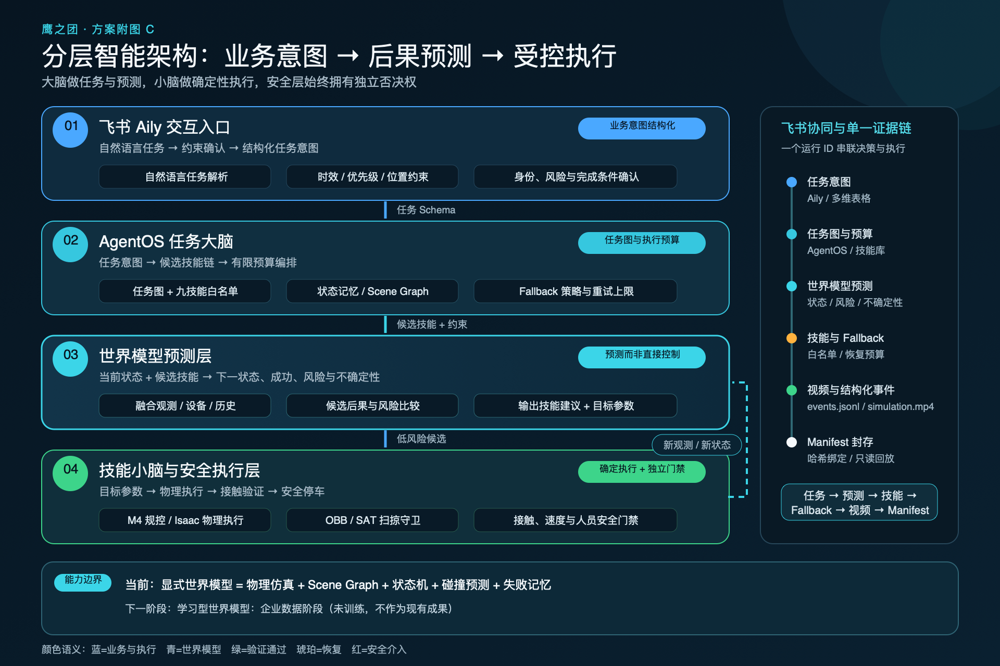

# 【40强赛】仙工智能🤝鹰之团｜可验证的层次化 VLA 智能叉车卸货系统


> **一句话方案**：我们为仙工智能的工业移动机器人构建一个“AgentOS 大脑 + 技能小脑 + 物理安全底座”的分层智能系统，让操作员可以用自然语言下发卸货任务，让机器人在仿真中自主拆解、执行、校验、恢复，并留下可复验的完整证据链。

---

## 一、参赛方案信息卡【必须包含】

| 项目 | 内容 |
| --- | --- |
| 参赛队伍 | 鹰之团 |
| 选择的企业赛题 | 仙工智能：工业场景分拣配送机器人方案 |
| 聚焦场景 | 前仓月台智能叉车完成集装箱卸货、搬运与异常处置 |
| 方案定位 | 面向企业合作验证的仿真 Demo；验证智能调度、技能执行、Fallback、人机协同和审计闭环 |
| 一句话价值 | 把“只能执行固定脚本的机器人”升级为“能理解任务、调用受控技能、遇错可恢复、全过程可追溯的具身智能系统” |
| 在线体验 | [https://demo.aplearn.xyz/](https://demo.aplearn.xyz/) |
| 公开代码与证据 | [https://github.com/imChenRH/seer-competition](https://github.com/imChenRH/seer-competition) |

### 团队成员与分工

| 成员 | 背景 | 主要分工 |
| --- | --- | --- |
| 陈睿泓（队长） | 中山大学计算机系，大二 | 整体算法架构设计、AgentOS 与 VLA 方案、资源获取、环境配置、证据规范与项目统筹 |
| 程千弘（队员） | 香港大学量化金融系，大二 | 仿真平台建模、仓储场景与机器人行为实现、运行数据分析和展示优化 |

### 飞书 AI 能力应用

本方案不是把飞书仅作为展示页面，而是把它设计为企业操作入口和协同中枢：

- **飞书 Aily**：接收操作员自然语言任务，整理约束，输出结构化任务意图。
- **飞书多维表格**：统一维护技能库、Fallback 策略库、任务运行表、审计日志表和叉车状态表五张核心数据表。
- **飞书消息**：在人工侵入、自动恢复失败或风险升级时推送告警和人工接管请求。
- **飞书开放平台 API**：连接 AgentOS、仿真服务和企业数据底座，避免在对话中自由编造技能或策略。
- **飞书会议与知识沉淀**：把企业访谈、试点参数和复盘结论沉淀为下一轮技能与策略更新依据。

---

## 二、参赛成果介绍【必须包含】

### 1. 场景、问题与核心痛点

我们选择的是前仓月台集装箱卸货。它看似只是“叉车进入集装箱—叉取货物—送至传送带”，实际却同时包含狭窄空间导航、货叉与货物联动、动态避障、对位误差、异常恢复和人机协作等问题。

企业现有方案往往在以下环节付出高成本：

1. **规则脚本脆弱**：货物位置、托盘姿态或障碍物稍有变化，固定流程就可能失效。
2. **异常依赖工程师**：抓取失败、路径阻塞和传感异常常需远程排查，故障定位慢。
3. **端到端模型难审计**：模型能够给出动作，却难解释为什么选择该动作、依据是什么、失败后为何切换策略。
4. **实机试错代价高**：直接在真实叉车和产线测试会带来停线、碰撞和安全风险。
5. **跨系统协同割裂**：操作指令、设备状态、告警、审计和复盘散落在不同系统中。

因此，本项目不追求让一个大模型直接控制所有底层关节，而是解决企业最关键的“最后一公里”：让 AI 深入任务链路，同时把可执行范围、恢复策略和安全边界锁定在可验证系统内。

### 2. 方案优势与创新性

#### 2.1 从“模型直接出动作”改为“分层大脑—小脑协同”

我们的核心创新是把高层理解与低层可靠执行明确分开：

- **大脑（Aily + AgentOS）**负责理解业务目标、拆解任务、选择技能、解释决策和触发 Fallback。
- **小脑（技能执行器 + 控制器 + 安全监控）**负责路径、抓取、放置、接触约束和状态校验。
- 大脑不能绕过技能白名单直接操纵设备；小脑不能擅自改变业务目标。

这使系统同时具备 AI 的适应能力和工业控制所需的确定性。



*图 1｜四层架构：飞书业务入口、AgentOS 决策层、VLA/技能层和仿真/物理安全层。*

#### 2.2 用白名单技能和 Fallback 把智能限制在安全范围内

AgentOS 只能从经过定义和测试的技能中组合任务，例如：定位目标、导航至预抓取位、对位、叉取、抬升验证、撤离、运输、放置和完成校验。执行过程中每一步都必须收到结构化状态，才能进入下一步。

异常发生时，系统不会无限重试，而是按预设策略升级：

1. 小范围重新对位；
2. 重新规划局部路径；
3. 降级为保守速度或安全姿态；
4. 暂停并请求人工介入。


*图 2｜九技能链和恢复状态机：所有重试、降级和人工介入均有明确触发条件。*

#### 2.3 把 VLA 变成可插拔的感知—动作模块，而不是不可控的总指挥

Fast-WAM 用于验证视觉—语言—动作模型能够接入统一任务闭环。我们选择官方 LIBERO task 8 的“将碗放入黄色盘子”任务，固定 5 个官方初始状态全部成功，每次执行 77–84 步，并绑定模型仓库、revision、权重哈希、动作记录和视频证据。


*图 3｜重新制作的 Fast-WAM 任务主视觉：黑碗与黄色盘子的关系清晰可见。该图只解释操作对象；成功结论以原始运行文件和录像为准。*

这里必须明确：上述结果只证明 **Fast-WAM 在该官方任务与固定初态下完成了接入闭环**，不代表 Fast-WAM 直接控制叉车，也不是通用成功率。叉车场景目前使用受控技能和仿真控制器，后续可在同一接口下接入更多 VLA 后训练模型。

#### 2.4 单一事实源：任何演示结论都能回到原始事件

每次运行生成结构化事件、状态、Fallback 记录、视频、摘要和 Manifest。网页展示不单独维护一套“好看的结果”，而是从同一证据包中读取；如果摘要与原始文件不一致、序列不连续或媒体哈希错误，该运行不会被正式展示。


*图 4｜从原始事件到网页呈现的单一事实源，避免手工剪辑与真实运行脱节。*

#### 2.5 仿真先行，把高成本实机试错前移

我们使用 Isaac Sim / OpenUSD 风格的仓储资产组织场景，同时以可重复的物理规则检查车辆、货物、集装箱、地面和障碍物关系。碰撞验证采用 2.5D OBB/SAT 扫掠检测，并对白名单接触做方向与间隙限制。

当前三类叉车正式场景共执行 **3,029,546 次碰撞检查**，禁用碰撞、穿透和接触违规均为 **0**。这一机制不仅用于“让视频不穿模”，更用于在动作进入实机前发现几何与路径风险。

### 3. 与传统方案的前后对比

| 对比维度 | 传统固定脚本 / 黑盒模型 | 本方案 |
| --- | --- | --- |
| 任务入口 | 工程师编程或固定按钮 | 操作员自然语言下达业务任务 |
| 决策方式 | 固定流程，或模型直接输出动作 | AgentOS 只组合白名单技能，并说明依据 |
| 低层执行 | 高层逻辑与控制耦合 | 技能小脑独立执行路径、抓取、放置和校验 |
| 异常处理 | 停机后人工排查，或无限重试 | Fallback 分级恢复，超过边界主动请求人工 |
| 安全机制 | 依赖现场测试和人工经验 | 仿真碰撞扫描、状态门禁、技能预算和人工侵入预检 |
| 可追溯性 | 日志零散，难复现实验 | 事件、动作、视频、摘要和 Manifest 统一绑定 |
| 新任务扩展 | 重写整套脚本 | 增加或重组技能，VLA 模块可替换 |
| 协同入口 | 多系统切换 | 飞书 Aily + 多维表格 + 告警消息统一协同 |

### 4. AI 解决方案与业务闭环

#### 4.1 完整任务流

```text
操作员自然语言指令
        ↓
飞书 Aily 结构化任务与约束
        ↓
AgentOS 查询技能库 / 设备状态 / Fallback 策略
        ↓
生成九技能执行链并逐步下发
        ↓
VLA、路径与控制技能执行
        ↓
物理状态校验与安全门禁
        ↓
完成 / 自动恢复 / 人工介入
        ↓
事件、视频与审计结果回写并展示
```

#### 4.2 四层职责

| 层级 | 主要组件 | 责任 | 不允许做的事 |
| --- | --- | --- | --- |
| 业务协同层 | 飞书 Aily、多维表格、消息 | 接收指令、管理业务数据、告警与复盘 | 直接控制机器人关节或绕过安全门禁 |
| 决策大脑层 | AgentOS、任务规划器、Fallback 决策器 | 拆解目标、选择技能、依据状态推进任务 | 编造不存在的技能或无限重试 |
| 技能小脑层 | VLA、导航、对位、抓放、验证技能 | 将技能参数变成受控动作并反馈结果 | 自行改变业务目标 |
| 物理安全层 | 仿真、控制器、碰撞检测、人工侵入监控 | 执行动作、检查接触与风险、必要时急停 | 为追求完成率忽略风险 |

#### 4.3 三类叉车场景实测

| 场景 | 结果 | 关键证据 |
| --- | --- | --- |
| 正常卸货 | COMPLETED | 20 条事件；九技能 9/9；仿真时钟 66.25 秒 |
| 抓取失败恢复 | COMPLETED | 24 条事件；触发 FB-F01 重新对位；77.25 秒完成 |
| 安全介入 | HUMAN_REQUIRED | 18 条事件；触发 FB-F02 与 FB-F07；36.0 秒进入人工接管 |
| Fast-WAM 碗到黄盘 | SUCCESS 5/5 | 官方 task 8；固定 5 个初态全部成功；77–84 步；逐次动作、状态和视频互相绑定 |

系统当前全量回归包含 **201 项 Python 测试**和 **50 项 JavaScript 断言**，覆盖任务契约、运行状态、Fallback、证据 Manifest、API 与网页展示等关键路径。

#### 4.4 操作与展示界面

网页把任务输入、技能链、左右视频、大脑推理、Fallback 和结构化证据放在同一界面中。左侧视频展示机器人在仓库中的真实任务过程，右侧同步呈现大脑如何选择技能、验证状态和处理异常，让评审既看见“机器人做了什么”，也看见“系统为什么这样做”。


*图 5｜正常、恢复、安全介入和 Fast-WAM 四类模式使用统一交互框架。*

### 5. 方案价值


*图 6｜当前可验证结果与企业试点目标分开表达，避免把目标包装成已实现收益。*

#### 5.1 当前已经验证的价值

- **闭环完整**：从任务输入、技能规划、物理执行、状态验证到证据输出均已连通。
- **异常可恢复**：抓取失败能够触发重新对位并完成任务；安全风险能够停止自动流程并请求人工介入。
- **结果可复验**：关键声明均能回到结构化事件、动作文件、视频和 Manifest。
- **模型可替换**：Fast-WAM 已通过同一证据接口接入，不需要推翻 AgentOS 和网页展示层。
- **安全前置**：通过仿真和 3,029,546 次碰撞检查，在接触真实设备前暴露几何和路径问题。

#### 5.2 试点目标（尚非实测收益）

以下指标是与企业合作后的验证目标，不是当前仿真 Demo 已经实现的经营结果：

- 将典型故障定位从天级缩短到小时级。
- 将经过模板化的新流程切换时间压缩到小时级。
- 在适用工况下，单机综合成本相对人工目标降低 **60%–80%**。
- 通过多机调度与复用，目标获得 **30% 以上**的协同效率提升。

这些目标必须在企业真实节拍、人员成本、设备利用率和安全约束下，以 A/B 测试或影子模式数据重新测量。

### 6. 体验流程与 Demo

#### 在线入口

- **Demo**：[https://demo.aplearn.xyz/](https://demo.aplearn.xyz/)
- **代码与证据**：[https://github.com/imChenRH/seer-competition](https://github.com/imChenRH/seer-competition)

建议评审按以下顺序体验：

1. 发送“将集装箱货物卸至传送带”的任务，观察正常技能链。
2. 切换“抓取失败恢复”，观察 FB-F01 如何重新对位后继续执行。
3. 切换“安全介入”，观察系统为什么停止自动流程并转入 HUMAN_REQUIRED。
4. 打开 Fast-WAM，查看碗到黄色盘子的固定初态执行、动作序列和证据绑定。
5. 在证据区核对运行 ID、事件数量、Fallback、终态、媒体和 Manifest。


*图 7｜在线 Demo 二维码。若二维码环境受限，可直接使用上方链接。*

当前在线页面已包含四类正式录像和结构化证据。3–5 分钟的独立讲解剪辑不是本次 Markdown 成稿的一部分，评审可直接通过网页复验完整过程。

---

## 三、自由展示【可选】

### 1. 与仙工智能技术栈的合作接口

我们的目标不是替换仙工智能已有控制平台，而是在其设备与接口之上增加可验证的智能任务层：


*图 8｜建议的企业集成边界：AgentOS 负责调度和审计，SRC/控制系统继续负责设备级可靠执行。*

拟合作验证的关键接口包括：

- SRC-5000 或同类控制器的任务下发、取消、暂停与状态查询。
- 地图、定位、路径、货叉高度、载荷和故障码数据。
- 机器人安全 PLC、急停、区域防护和人工接管状态。
- 真实货物、托盘、集装箱和传送带的几何及节拍参数。
- 企业允许的技能白名单、Fallback 次数、超时和风险升级规则。

### 2. 三阶段影子模式路线图


*图 9｜先观察、再建议、后闭环，逐步扩大自动化权限。*

| 阶段 | 系统权限 | 验证重点 | 退出条件 |
| --- | --- | --- | --- |
| 影子观察 | 只读取真实状态，不下发动作 | 决策与现场操作是否一致；故障识别是否及时 | 连续运行达到企业约定样本量，且无高风险漏报 |
| 人工确认 | 系统生成任务和恢复建议，由操作员确认后执行 | 建议采纳率、误报率、节拍影响、人工体验 | 关键技能和 Fallback 通过验收，安全接口完成联锁测试 |
| 受控闭环 | 仅对白名单任务自动执行，超出边界转人工 | 完成率、恢复率、安全事件、维护成本 | 通过企业安全评审和阶段性 ROI 验证 |

### 3. 技术路线定位


*图 10｜本方案位于“通用大模型能力”和“工业确定性控制”之间，重点解决可控编排、恢复和证据闭环。*

我们认为，工业具身智能的竞争力不只来自更大的模型，而来自四项能力的共同成立：

1. 模型能理解新的业务目标；
2. 技能能够稳定执行并返回真实状态；
3. 异常可以在有限预算内恢复或安全退出；
4. 每一个结果都能被工程师、企业和评审复验。

这也是本项目希望与仙工智能进一步合作的核心：用真实设备接口和现场数据验证这套分层架构，而不是在仿真中追求无法迁移的“完美演示”。

---

## 四、附件与复验入口【可选】

### 1. 交付清单

| 类别 | 内容 | 复验方式 |
| --- | --- | --- |
| 在线产品 | 四模式 Web Demo | 打开 [demo.aplearn.xyz](https://demo.aplearn.xyz/) |
| 源代码 | AgentOS、技能、Fallback、证据 API、前端 | 查看 [GitHub 仓库](https://github.com/imChenRH/seer-competition) |
| 仿真资产 | 仓储场景、碰撞几何、运行配置 | 按仓库 README 在本地运行 |
| 运行证据 | JSONL 事件、动作、摘要、Manifest、视频 | 通过网页证据区或仓库 evidence 目录核对 |
| 方案文档 | 本文及配图 | 仓库 `参赛方案/` 目录 |

### 2. 证据索引

| 声明 | 对应证据 |
| --- | --- |
| 正常流程 9/9 完成 | 正常场景事件流、摘要、Manifest 与视频 |
| 抓取失败可恢复 | recovery 场景中的 FB-F01 事件和完成终态 |
| 安全风险转人工 | intervention 场景中的 FB-F02、FB-F07 和 HUMAN_REQUIRED 终态 |
| Fast-WAM 固定 5 初态成功 | attempt-1 至 attempt-5 的动作、状态、视频和汇总 |
| 三场景无禁用碰撞 | 碰撞审计报告和 Manifest 中的 certification 字段 |
| 网页不展示伪造结果 | 服务端证据校验、媒体白名单和前端一致性测试 |

### 3. 当前边界与风险声明

> **当前成果是可运行、可复验的仿真原型，不是已经在企业产线投入使用的产品。** 系统尚未连接真实 SRC-5000、尚未连接叉车安全 PLC，也没有在真实集装箱、托盘和现场人员环境中完成安全认证。Fast-WAM 结果仅对应官方 LIBERO task 8 的固定初态。本文所有经营收益均以“试点目标”标识，必须通过企业数据验证。

### 4. 下一步合作建议

1. 与仙工智能确认一个最小真实任务：单箱、固定托盘、固定起终点的卸货或搬运。
2. 获取只读状态和仿真接口，先完成数字孪生参数对齐。
3. 在真实系统旁路运行影子模式，比较 AgentOS 建议与现场操作员决策。
4. 选择 3–5 个高频异常定义企业认可的 Fallback 与人工接管规则。
5. 在安全联锁完成后，仅开放白名单技能的受控闭环。
6. 用任务完成率、平均节拍、恢复率、人工介入率、安全事件和维护工时共同验收。

---

**项目入口**：[在线 Demo](https://demo.aplearn.xyz/) ｜ [公开仓库](https://github.com/imChenRH/seer-competition)

**队伍**：鹰之团 ｜ **企业赛题**：仙工智能工业场景分拣配送机器人方案
